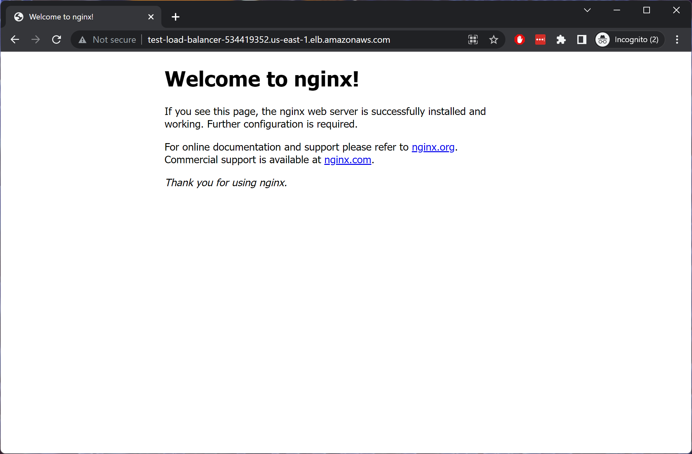

# cloudmargin-tech-test

## Requirements

- Store backend state remotely with state locking
- Terraform uses a non-default workspace
- Terraform assumes an IAM role
- Hosted in the `eu-west-1` region balanced over the entire availaiblity zone
- Create public &amp; private VPCs
- Standard ports 80/443
- Load balanced containers with CPU and memory thresholds
- Run the `nginx` container image
- Take as little time as possible ([^1])

## Plan of Action

Create a workspace called `test` and AWS profile called `cloudmargin`.

I'll be making use of Fargate (in order to use the minimal infrastructure possible). This supports all the features requested and should be easy enough to implement within the timeframe. I'm more comfortable with using EKS and Kubernetes in my day job, but this scenario doesn't need orchestration so I should have enough konwledge to accomplish the task.

Having used S3 and DynamoDB previously as backing stores, I can reuse those modules and adjust for the `eu-west-1` region. These will be created with an independant Terraform plan (under a separate `/prerequisite-setup` folder). I'll create a `robot-role` for the main Terraform plan to assume.


## Limitations

- The role assumed by Terraform will just be a placeholder (i.e. allow `*`), which is obviously not for production
- AWS infrastructure won't have tags
- Varibles etc won't have proper descriptions and conditional logic/type checking
- No container registry, HTTPS, granular security groups, logging, etc.

## References

| Description | Url |
| ----------- | ----------- |
| Official AWS Terraform docs | https://registry.terraform.io/providers/hashicorp/aws/latest/docs |
| Example of standing up Fargate with Terraform | https://github.com/finleap/tf-ecs-fargate-tmpl |
| Example of using `aws_iam_policy_document` rather than JSON for type safety | https://cloudonaut.io/defining-iam-policies-with-terraform/ |
| Example of storing `.tfstate` in S3 &amp; DynamoDB | https://stackoverflow.com/questions/47913041/initial-setup-of-terraform-backend-using-terraform |

---

## Working Notes / Issues

1. Seems I'm unable to create anything on the specified AWS account (access denied). Will revert to a personal account for now.

```
Error: error creating S3 Bucket (alx-cloudmargin-tfstate): AccessDenied: Access Denied
status code: 403, request id: S019FNEQ7VDX7DAH, host id: M/4wNvKopOPHGD655DPnBQ1DYusO3HaHh9NNIH18sMSW9PaPJwHNt627XjL6M7F49BORCdBTriY=
```

2. Configured to a personal AWS account (692640583927) on the `us-east-1` region, we have `nginx` available on: http://test-load-balancer-534419352.us-east-1.elb.amazonaws.com/




---

[^1]: There's a 3 hour time limit, but also because I currently have a casserole on the go...!